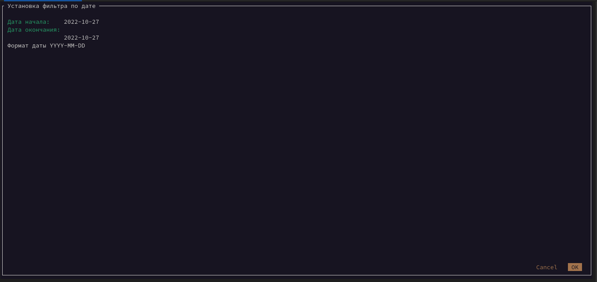

### Консольная утилита для воспроизведение терминальных сессий tlog, записываемых в Systemd Journal

#### Использует два модуля:

create_db.py создает и наполняет базу данных sqllite записями терминальных сессий. Использует модуль python sqlite3, база данных храниться в файле /var/db/tldatabase.db. Для извлечения записей терминальных сессий используется модуль python systemd. Подробная информация по установке и работе модуля https://github.com/systemd/python-systemd. Следует обратить внимание на версию интерпретатора python для работы с systemd - она должна быть не выше 3.6.8. Процесс наполнения базы данных выполняется непрерывно,  поэтому самым простым вариантом будет использование задания Cron:

```
*/5 * * * * /usr/bin/python3 /root/tsplayer/create_db.py
```

tsplayer.py сам плеер, для работы с терминальными сессиями использует базу данных созданную create_db.py. Для воспроизведения использует записи Systemd Journal. Т.е. база данных используется только для удобного предоставления записей терминальных сессий, для их просмотра, фильтра и запуска воспроизведения. Подробная информация по tlog https://github.com/Scribery/tlog

#### Опции для утилиты:

 

```
Ctrl+S - установить фильтр по диапазону дат

Ctrl+R - сбросить фильтр

Ctrl+Q - выход
```

